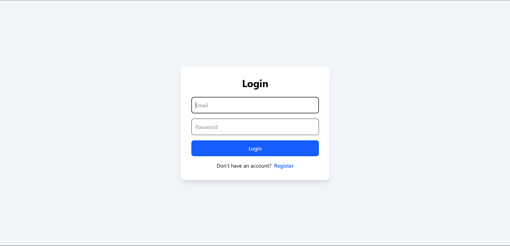
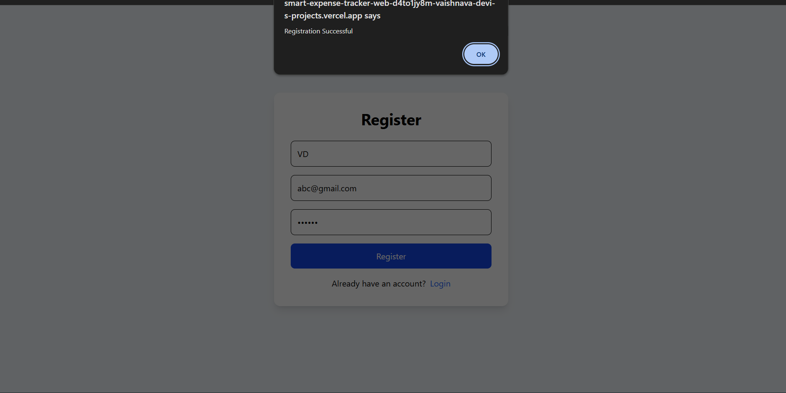
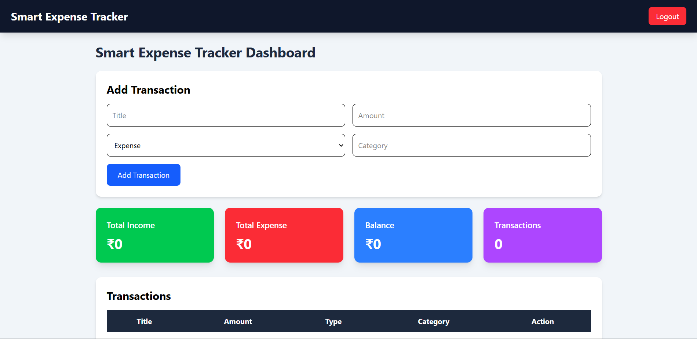
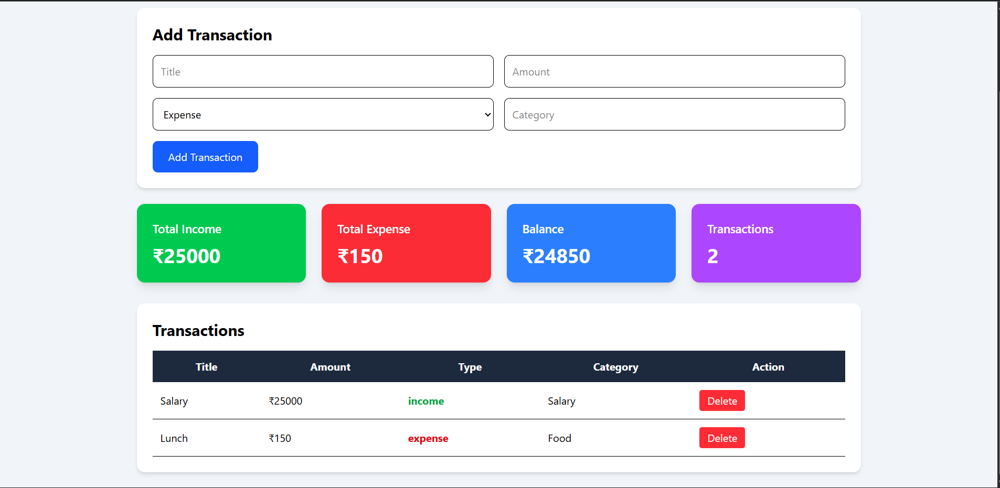
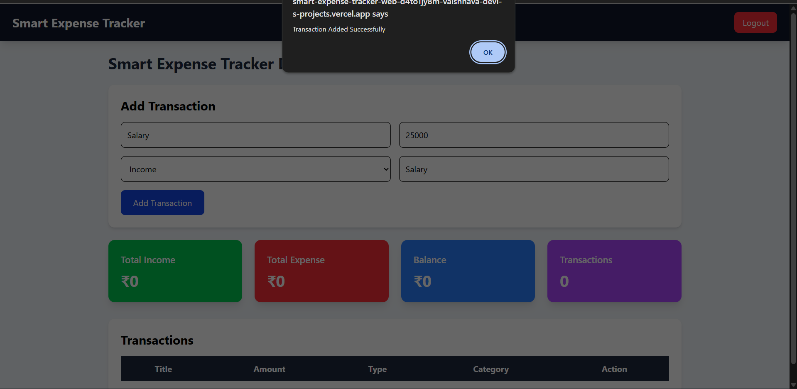

# 💰 Smart Expense Tracker Web Application

A modern Full-Stack MERN Expense Tracker designed to help users efficiently manage income, expenses, budgets, and financial records through an interactive dashboard with secure authentication.


---

## 🚀 Live Demo

### 🌐 Frontend

https://smart-expense-tracker-web-d4to1jy8m-vaishnava-devi-s-projects.vercel.app

### ⚙️ Backend API

https://smart-expense-tracker-api-p51v.onrender.com

---

# 📸 Application Screenshots

## 🔐 Login Page



---

## 📝 Register Page



---

## 📊 Dashboard Overview



---

## 💹 Financial Summary Dashboard



---

## ➕ Add Transaction



---

## 📌 Overview

Smart Expense Tracker is a full-stack financial management application built using the MERN Stack. It enables users to securely register, authenticate, manage income and expenses, monitor financial activities, and track spending patterns through an interactive dashboard.

The application demonstrates modern web development practices including JWT Authentication, Protected Routes, RESTful APIs, MongoDB Atlas integration, React-based frontend development, and responsive Tailwind CSS design.

---

## ✨ Features

### 🔐 Authentication & Security

- User Registration
- User Login
- JWT Authentication
- Protected Routes
- Secure Password Hashing using bcryptjs
- Session Management

### 📊 Dashboard Analytics

- Total Income Tracking
- Total Expense Tracking
- Current Balance Calculation
- Total Transactions Counter
- Real-Time Dashboard Updates

### 💸 Transaction Management

- Add Income
- Add Expenses
- View Transactions
- Delete Transactions
- Category-Based Tracking

### 💰 Budget Management

- Create Monthly Budgets
- View Budget Details
- Budget Monitoring

### 🎨 User Experience

- Responsive Design
- Modern Dashboard Interface
- Clean Navigation
- Real-Time Updates

---

## 🛠️ Tech Stack

### Frontend

- React.js
- React Router DOM
- Axios
- Tailwind CSS
- Vite

### Backend

- Node.js
- Express.js
- JWT Authentication
- bcryptjs
- Morgan

### Database

- MongoDB Atlas
- Mongoose ODM

### Deployment

- Render (Backend)
- Vercel (Frontend)

---

## 📂 Project Structure

```text
Smart-Expense-Tracker-Web-App
│
├── client
│   ├── public
│   │   └── screenshots
│   │
│   ├── src
│   │   ├── components
│   │   ├── pages
│   │   ├── routes
│   │   ├── services
│   │   ├── App.jsx
│   │   └── main.jsx
│   │
│   └── package.json
│
├── server
│   ├── config
│   ├── controllers
│   ├── middleware
│   ├── models
│   ├── routes
│   ├── server.js
│   └── package.json
│
├── .gitignore
├── LICENSE
└── README.md
```

---

## ⚙️ Installation

### Clone Repository

```bash
git clone https://github.com/VaishnavaDevi-R/Smart-Expense-Tracker-Web-App.git
```

### Navigate to Project

```bash
cd Smart-Expense-Tracker-Web-App
```

### Backend Setup

```bash
cd server
npm install
```

Create `.env`

```env
PORT=5000
MONGO_URI=YOUR_MONGODB_CONNECTION_STRING
JWT_SECRET=YOUR_SECRET_KEY
```

Run Backend

```bash
npm start
```

### Frontend Setup

```bash
cd client
npm install
npm run dev
```

---

## 🔒 Security Features

- JWT Authentication
- Password Hashing
- Protected Routes
- Secure MongoDB Atlas Connection
- Environment Variable Protection

---

## 📈 Learning Outcomes

- MERN Stack Development
- RESTful API Development
- Authentication & Authorization
- MongoDB Atlas Integration
- React Router Implementation
- Axios API Integration
- Tailwind CSS Styling
- Deployment using Render & Vercel
- Git & GitHub Workflow

---

## 👩‍💻 Author

**Vaishnava Devi**

Aspiring Full Stack Developer passionate about building scalable and user-friendly web applications.

---

## ⭐ Support

If you found this project useful, consider giving it a ⭐ on GitHub.